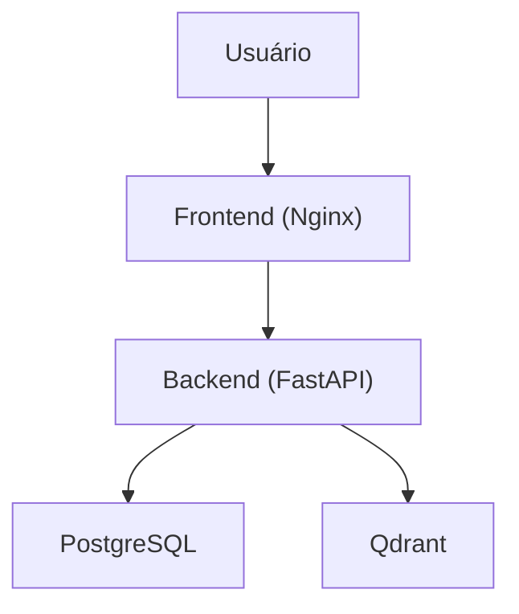

# MentorIA- Projeto Final de Curso I

## Visão Geral

Este projeto consiste no desenvolvimento de uma aplicação de **RAG (Retrieval-Augmented Generation)** robusta e escalável, integrada a um sistema de chat inteligente. O sistema permite a ingestão de documentos, processamento vetorial e interação via chat contextualizado, utilizando modelos de Inteligência Artificial para gerar respostas precisas baseadas no conhecimento fornecido.

O projeto faz parte do **Projeto Final de Curso (PFC)** e encontra-se na **Fase 01 (7º Período)**, focada na consolidação e integração entre Frontend, Backend e Camada de Dados.

## Funcionalidades Principais

- **Autenticação e Segurança:** Sistema de login seguro com JWT (JSON Web Tokens).
- **Chat Inteligente (RAG):** Interface de chat que permite perguntas em linguagem natural, com respostas fundamentadas em documentos carregados.
- **Gestão de Documentos:** Upload e processamento de arquivos para base de conhecimento.
- **Histórico de Conversas:** Persistência de chats e mensagens.
- **Interface Responsiva:** Frontend moderno e responsivo (SPA).

## Arquitetura do Sistema

O sistema utiliza uma arquitetura de **Microsserviços Containerizados**, orquestrados via Docker Compose:

1. **Frontend (Web):** SPA desenvolvida em HTML5, CSS3 e JavaScript (Vanilla), servida via Nginx.
2. **Backend (API):** API RESTful desenvolvida com **FastAPI (Python)**.
3. **Banco de Dados Relacional:** **PostgreSQL** para dados estruturados (usuários, chats, histórico).
4. **Banco de Dados Vetorial:** **Qdrant** para armazenamento de embeddings e busca semântica.



## Tecnologias Utilizadas

- **Backend:** Python 3.12, FastAPI, SQLAlchemy, Alembic, LangChain/LlamaIndex (integração RAG).
- **Frontend:** HTML5, CSS3, JavaScript, Nginx.
- **Infraestrutura:** Docker, Docker Compose.
- **IA/ML:** PyTorch, Transformers, Qdrant Client.
- **Banco de Dados:** PostgreSQL 15, Qdrant.

## Pré-requisitos

- [Docker](https://www.docker.com/get-started) e Docker Compose instalados.
- Git instalado.

## Como Executar o Projeto

1. **Clone o repositório:**

   ```bash
   git clone <URL_DO_REPOSITORIO>
   cd MentorIA
   ```
2. **Configure as variáveis de ambiente:**
   Crie um arquivo `.env` na raiz do projeto (baseado no `.env.example`, se disponível) e configure as credenciais necessárias (chaves de API de LLMs, senhas de banco, etc.).
3. **Inicie os contêineres:**

   ```bash
   docker-compose up --build -d
   ```
4. **Acesse a aplicação:**

   - Frontend: `http://localhost:3000` (ou porta configurada).
   - API Docs (Swagger): `http://localhost:8000/docs`.

## Estrutura do Repositório

- `/src/api`: Código fonte do Backend (FastAPI).
- `/src/web`: Código fonte do Frontend (HTML/JS/CSS).
- `/shared`: Códigos compartilhados (Modelos de banco, etc.).
- `/alembic`: Migrações de banco de dados.
- `/config`: Configurações globais e logs.
- `/docs`: Documentação do projeto.

## Autores

**Equipe Techstein**
Projeto desenvolvido para a disciplina de Projeto Final de Curso.
